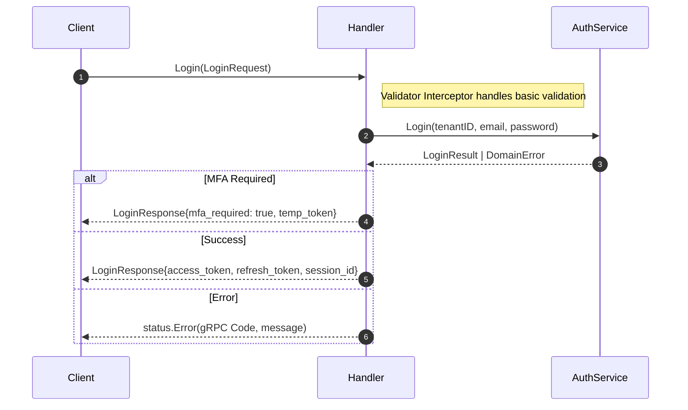
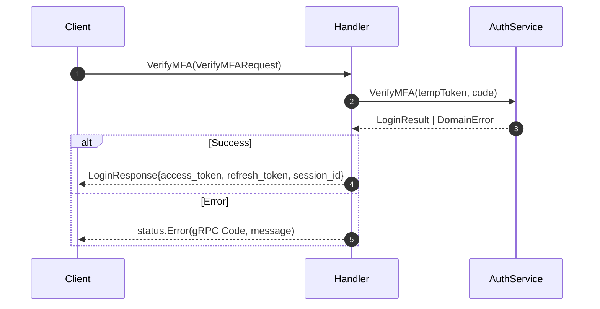
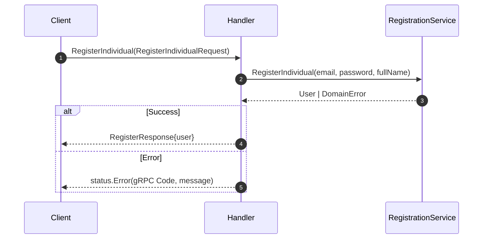
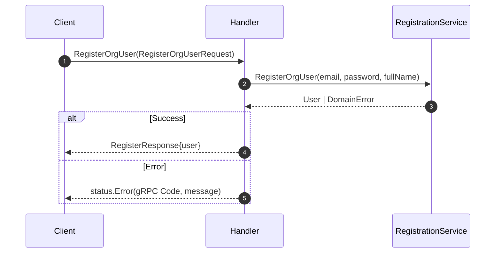
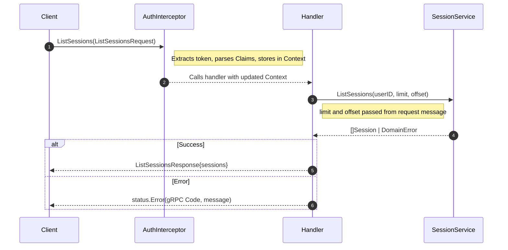

# gRPC Handler Sequence Diagrams

These diagrams show the request lifecycle for the primary gRPC endpoints.
Just like the REST handlers, gRPC handlers are entirely responsible for transport parsing, invoking structural validation, calling the domain service, and wrapping the response in protobuf messages. No business logic lives at this layer.

---

## Interceptors

gRPC relies on interceptors (the equivalent of HTTP middleware) to process requests before they hit the handler.

1. **Validator Interceptor**: Runs structural validation (e.g., using `protoc-gen-validate`) before the handler is invoked. If it fails, it returns `codes.InvalidArgument`.
2. **Auth Interceptor**: For protected RPCs, this extracts the bearer token from the metadata, calls `TokenService.ValidateAccessToken`, and injects the `Claims` into the `context.Context`. If invalid, it returns `codes.Unauthenticated`.

---

## Error Status Mapping

Domain errors are mapped to standard gRPC `codes`:

| Service Error | gRPC Status Code | Description |
|---|---|---|
| `ErrValidation` | `InvalidArgument` (3) | Input does not meet basic validation rules |
| `ErrTenantNotFound` | `Unauthenticated` (16) | Maps to unauthenticated to prevent enumeration |
| `ErrInvalidCredentials` | `Unauthenticated` (16) | Wrong email or password |
| `ErrUserDisabled` | `PermissionDenied` (7) | User suspended or pending |
| `ErrTenantSuspended` | `PermissionDenied` (7) | Tenant is not active |
| `ErrEmailTaken` | `AlreadyExists` (6) | Email already in use |
| `ErrInvalidToken` | `Unauthenticated` (16) | Expired or invalid token |
| `ErrForbidden` | `PermissionDenied` (7) | Actor lacks permissions |

---

## 1. Auth Service

### Login

**Status Codes**

| Service Error | gRPC Status |
|---|---|
| `ErrTenantNotFound` | `Unauthenticated` |
| `ErrInvalidCredentials` | `Unauthenticated` |
| `ErrUserDisabled` | `PermissionDenied` |
| `ErrTenantSuspended` | `PermissionDenied` |

---

### Verify MFA

**Status Codes**

| Service Error | gRPC Status |
|---|---|
| `ErrInvalidToken` | `Unauthenticated` |
| `ErrInvalidMFACode` | `InvalidArgument` |

---

## 2. Registration Service

### Register Individual

**Status Codes**

| Service Error | gRPC Status |
|---|---|
| `ErrInvalidEmail` | `InvalidArgument` |
| `ErrEmailTaken` | `AlreadyExists` |
| `ErrWeakPassword` | `InvalidArgument` |

---

### Register Org User

**Status Codes**

| Service Error | gRPC Status |
|---|---|
| `ErrPublicDomainNotAllowed` | `InvalidArgument` |
| `ErrTenantSuspended` | `PermissionDenied` |
| `ErrEmailTaken` | `AlreadyExists` |

---

## 3. Session Service

### List Sessions

**Status Codes**

| Service Error | gRPC Status |
|---|---|
| `ErrInvalidToken` | `Unauthenticated` |