# REST Handler Sequence Diagrams

These diagrams show the full request lifecycle for each REST endpoint.
Handlers are responsible for: parsing the request, calling the validator, calling the service, and writing the response.
No business logic lives in handlers — they delegate entirely to the service layer.

---

## Auth

### POST /v1/auth/login

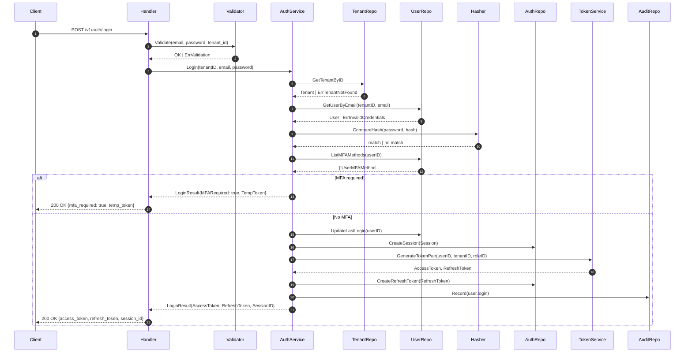

**Error responses**

| Service Error | HTTP Status | Response Code |
|---|---|---|
| ErrTenantNotFound | 401 | ErrInvalidCredentials |
| ErrTenantSuspended | 403 | ErrTenantSuspended |
| ErrInvalidCredentials | 401 | ErrInvalidCredentials |
| ErrUserDisabled | 403 | ErrUserDisabled |

> Tenant not found maps to 401 not 404 — prevents tenant enumeration.

---

### POST /v1/auth/mfa/verify

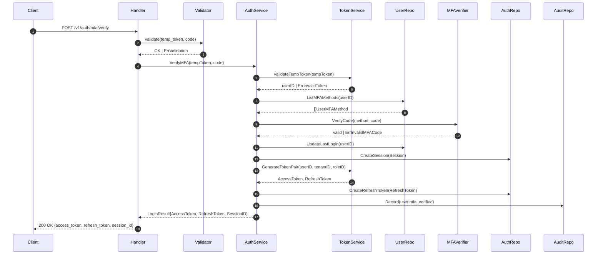

**Error responses**

| Service Error | HTTP Status | Response Code |
|---|---|---|
| ErrInvalidToken | 401 | ErrInvalidToken |
| ErrInvalidMFACode | 401 | ErrInvalidMFACode |

---

### POST /v1/auth/logout

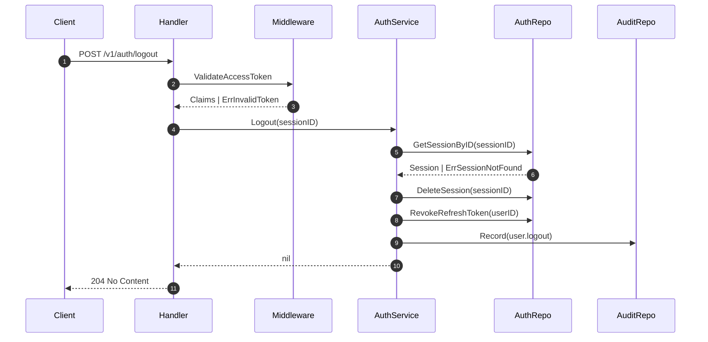

**Error responses**

| Service Error | HTTP Status | Response Code |
|---|---|---|
| ErrInvalidToken | 401 | ErrInvalidToken |
| ErrSessionNotFound | 404 | ErrSessionNotFound |

---

### POST /v1/auth/logout-all

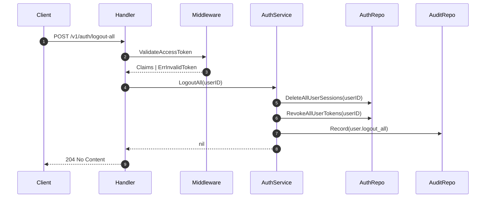

---

### POST /v1/auth/token/refresh

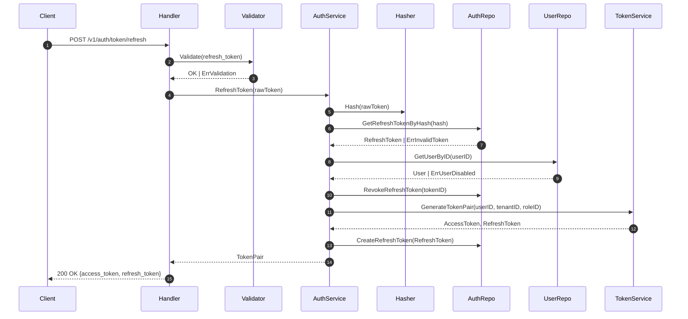

**Error responses**

| Service Error | HTTP Status | Response Code |
|---|---|---|
| ErrInvalidToken | 401 | ErrInvalidToken |
| ErrTokenExpired | 401 | ErrTokenExpired |
| ErrUserDisabled | 403 | ErrUserDisabled |

---

## Registration

### POST /v1/auth/register/individual

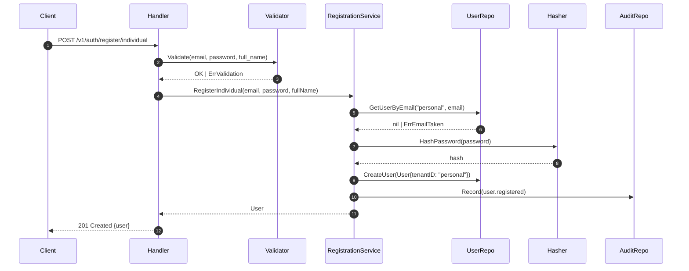

**Error responses**

| Service Error | HTTP Status | Response Code |
|---|---|---|
| ErrInvalidEmail | 422 | ErrInvalidEmail |
| ErrEmailTaken | 409 | ErrEmailTaken |
| ErrWeakPassword | 422 | ErrWeakPassword |

---

### POST /v1/auth/register/org

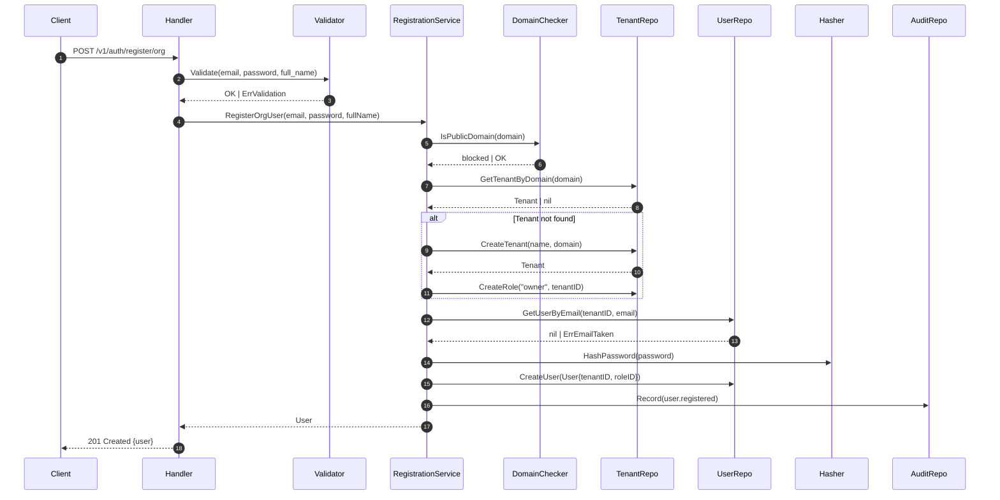

**Error responses**

| Service Error | HTTP Status | Response Code |
|---|---|---|
| ErrInvalidEmail | 422 | ErrInvalidEmail |
| ErrPublicDomainNotAllowed | 400 | ErrPublicDomainNotAllowed |
| ErrTenantSuspended | 403 | ErrTenantSuspended |
| ErrEmailTaken | 409 | ErrEmailTaken |
| ErrWeakPassword | 422 | ErrWeakPassword |

---

### POST /v1/auth/register/invitation

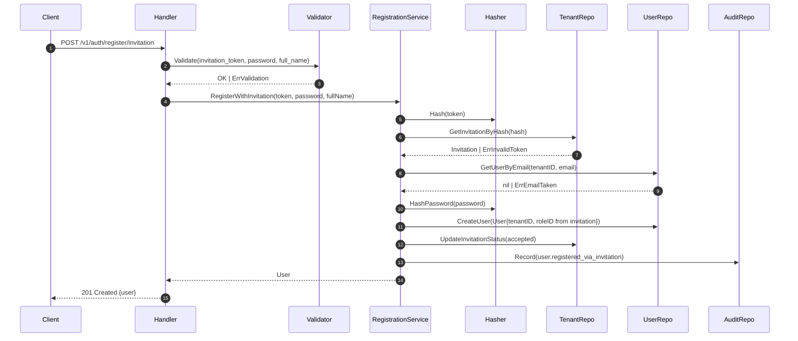

**Error responses**

| Service Error | HTTP Status | Response Code |
|---|---|---|
| ErrInvalidToken | 400 | ErrInvalidToken |
| ErrInvitationExpiredOrUsed | 400 | ErrInvitationExpiredOrUsed |
| ErrEmailTaken | 409 | ErrEmailTaken |
| ErrWeakPassword | 422 | ErrWeakPassword |

---

## Password

### POST /v1/auth/password/forgot

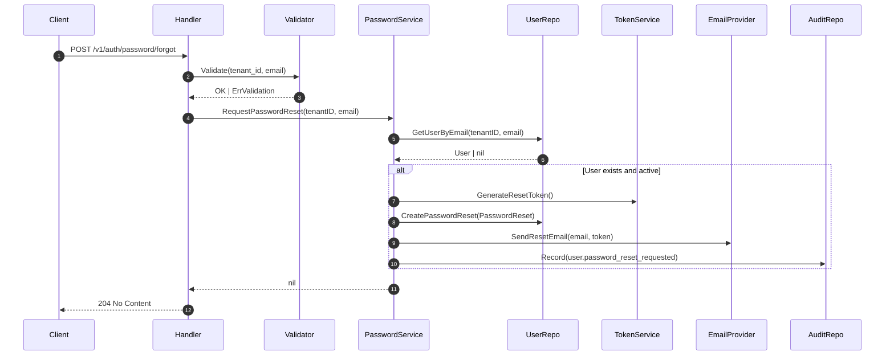

> Always 204 regardless of whether email exists.

---

### POST /v1/auth/password/reset

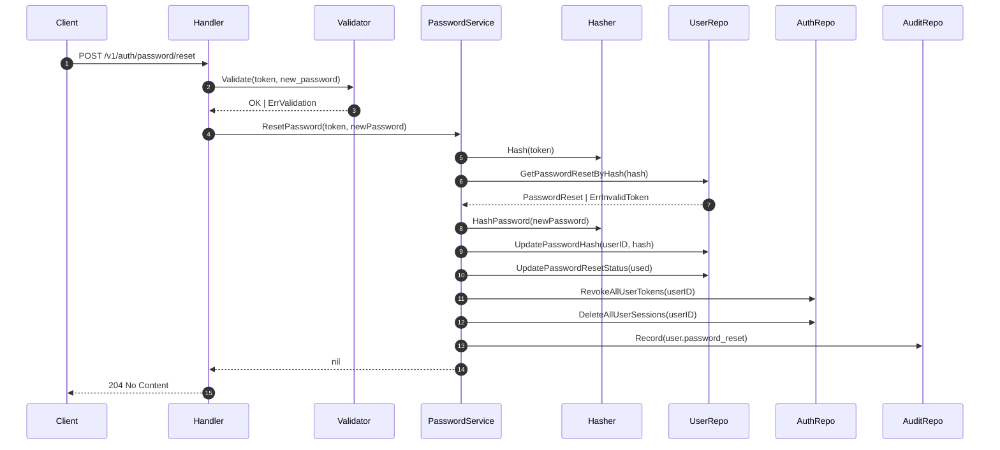

**Error responses**

| Service Error | HTTP Status | Response Code |
|---|---|---|
| ErrInvalidToken | 400 | ErrInvalidToken |
| ErrTokenExpired | 400 | ErrTokenExpired |
| ErrWeakPassword | 422 | ErrWeakPassword |

---

### POST /v1/auth/password/change

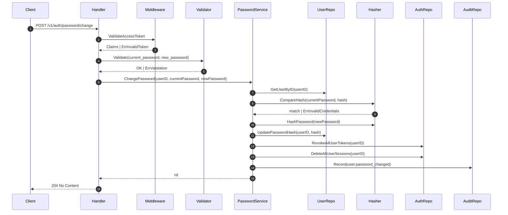

**Error responses**

| Service Error | HTTP Status | Response Code |
|---|---|---|
| ErrInvalidCredentials | 401 | ErrInvalidCredentials |
| ErrWeakPassword | 422 | ErrWeakPassword |

---

## MFA

### POST /v1/me/mfa/totp/enroll

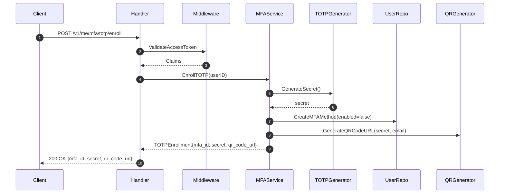

---

### POST /v1/me/mfa/totp/activate

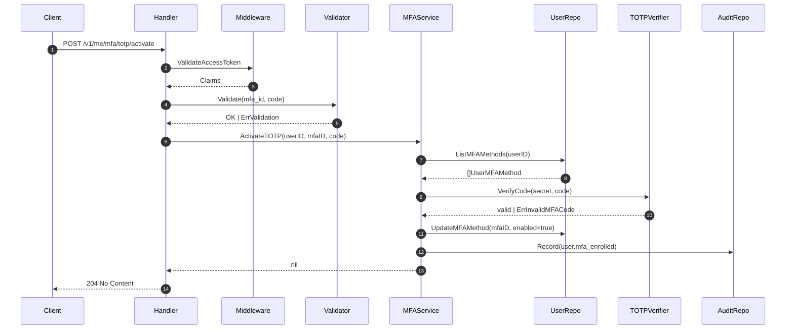

**Error responses**

| Service Error | HTTP Status | Response Code |
|---|---|---|
| ErrMFAMethodNotFound | 404 | ErrMFAMethodNotFound |
| ErrMFAAlreadyEnabled | 409 | ErrMFAAlreadyEnabled |
| ErrInvalidMFACode | 400 | ErrInvalidMFACode |

---

## Sessions

### GET /v1/me/sessions

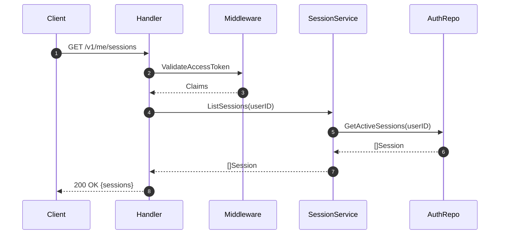

---

### DELETE /v1/me/sessions/{session_id}

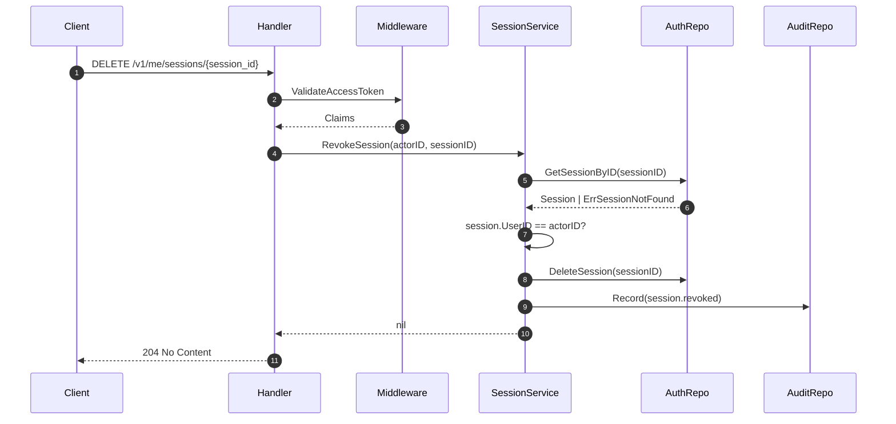

**Error responses**

| Service Error | HTTP Status | Response Code |
|---|---|---|
| ErrSessionNotFound | 404 | ErrSessionNotFound |
| ErrForbidden | 403 | ErrForbidden |

---

## Invitations

### POST /v1/tenants/{tenant_id}/invitations

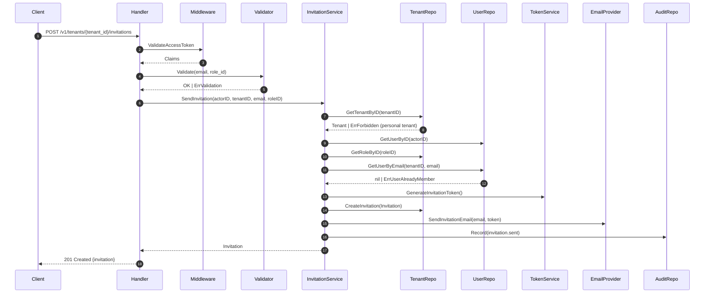

**Error responses**

| Service Error | HTTP Status | Response Code |
|---|---|---|
| ErrForbidden | 403 | ErrForbidden |
| ErrRoleNotFound | 404 | ErrRoleNotFound |
| ErrUserAlreadyMember | 409 | ErrUserAlreadyMember |

---

## Audit Logs

### GET /v1/tenants/{tenant_id}/audit-logs

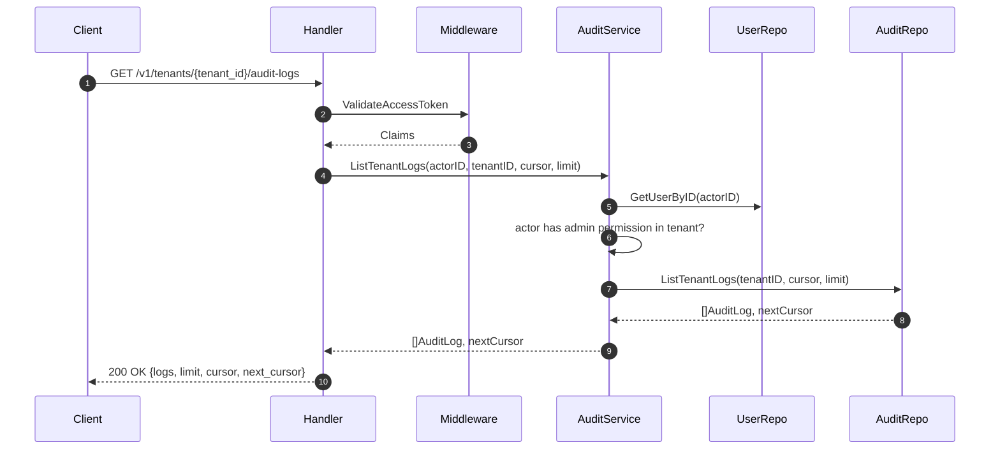

**Error responses**

| Service Error | HTTP Status | Response Code |
|---|---|---|
| ErrForbidden | 403 | ErrForbidden |