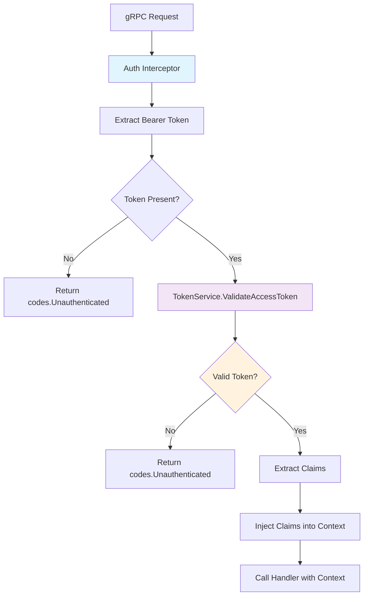
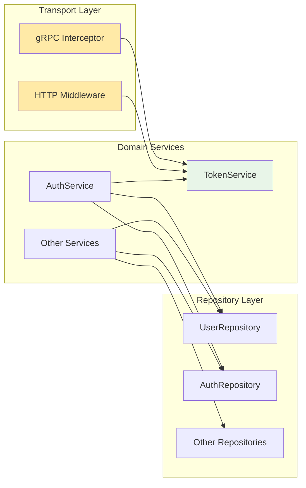
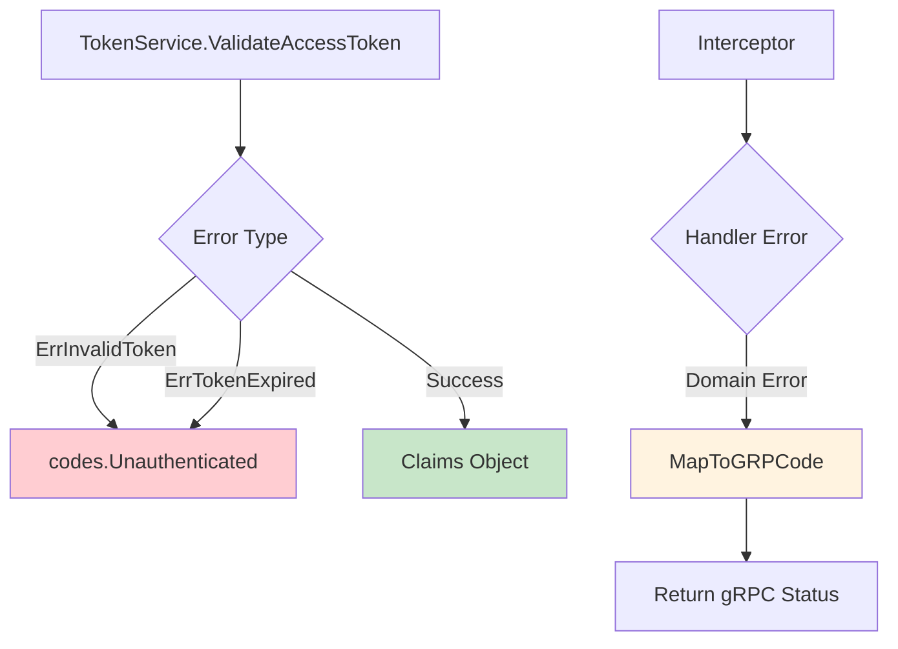

# JWT Validation Flow Architecture

## Current Architecture (After Fix)

## Service Dependencies

## Key Design Decisions

### 1. **TokenService Handles JWT Operations**
- **Single Responsibility**: Only token generation, validation, parsing
- **No Business Logic**: Doesn't know about users, tenants, or auth flows
- **Stateless**: No database calls for token validation

### 2. **AuthService Handles Auth Business Logic**
- **Orchestrates**: Calls TokenService for token operations
- **Business Rules**: Login flows, MFA, session management
- **Stateful**: Database calls for user/tenant validation

### 3. **Interceptor is Transport-Agnostic**
- **Clean Separation**: Only extracts tokens and injects claims
- **Error Mapping**: Translates domain errors to gRPC codes
- **No Dependencies**: Only depends on TokenService interface

## Error Flow Mapping

## Implementation Sequence

1. **Phase 1**: Move `ValidateAccessToken` to `TokenService`
2. **Phase 2**: Update interceptor to use `TokenService`
3. **Phase 3**: Add error mapping helper
4. **Phase 4**: Audit and complete remaining services

## Benefits of This Architecture

- ✅ **Testable**: Each service has clear boundaries
- ✅ **Maintainable**: Single responsibility per service
- ✅ **Scalable**: Easy to add new token types or validation rules
- ✅ **Secure**: Clear separation of concerns reduces attack surface
