# Central Authentication Service — Database Schema

This folder contains structured documentation for all database entities.

## Files Overview

| File | Purpose |
|------|---------|
| **erd.mmd** | Mermaid ER diagram (source) |
| **erd.svg** | Rendered ERD image |
| **tables.md** | Table definitions, columns, types, indexes |
| **structs.md** | Go struct representations (class diagrams + raw structs) |
| **constraints.md** | Unique keys, foreign keys, indexes, PK/FK rules |
| **enums.md** | All enum values (status codes, types) |

## Quick View

