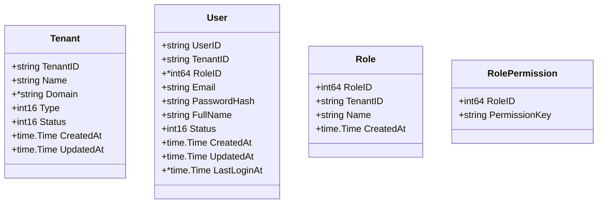
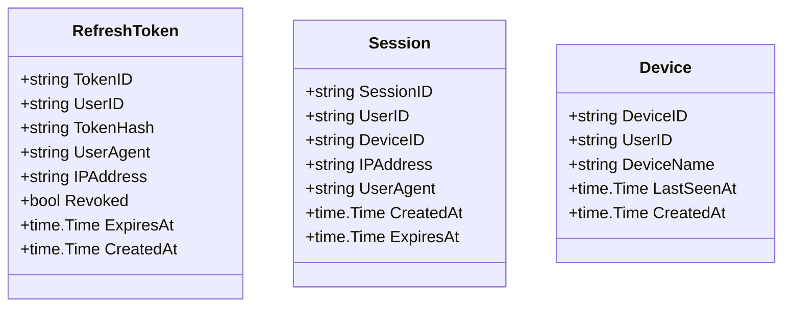
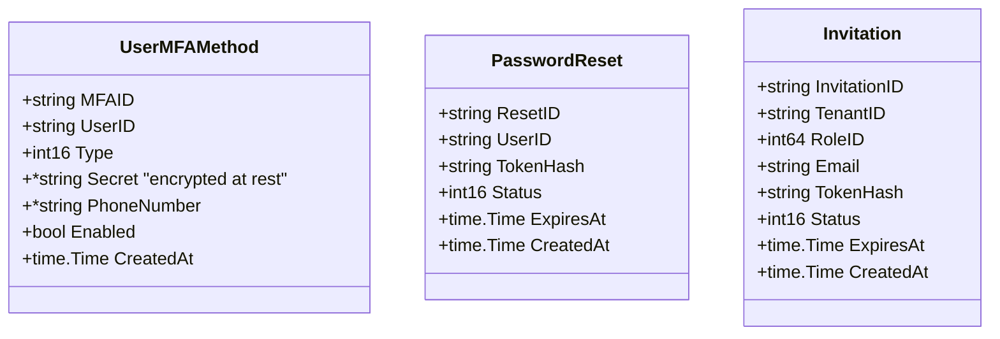
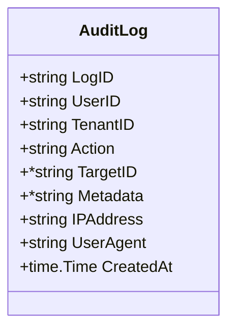

# Go Struct Definitions

This document describes all Go structs that map directly to database tables.
Nullable DB columns are expressed as pointer types.
Smallint DB columns map to int16.

---

## 1. Core Entities

---

## 2. Authentication & Session

---

## 3. MFA & Security

---

## 4. Audit Logging

---

## Type Reference

| DB Type   | Go Type      | Notes                        |
|-----------|--------------|------------------------------|
| string    | string       |                              |
| int64     | int64        |                              |
| smallint  | int16        |                              |
| bool      | bool         |                              |
| datetime  | time.Time    |                              |
| nullable  | pointer (*)  | e.g. *string, *int64, *time.Time |