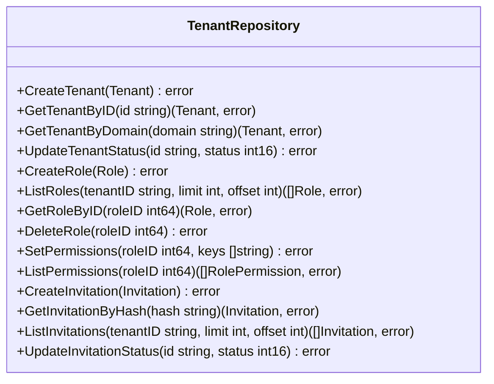
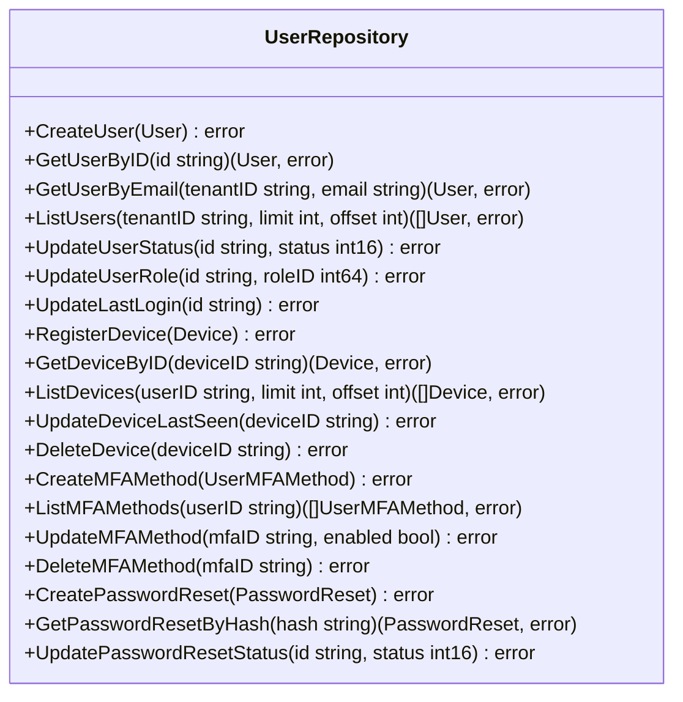
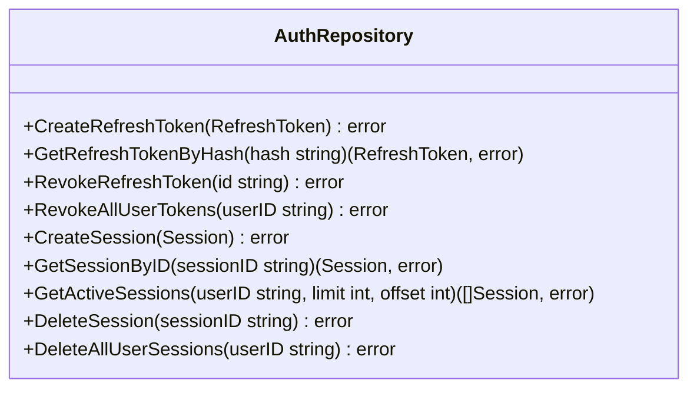
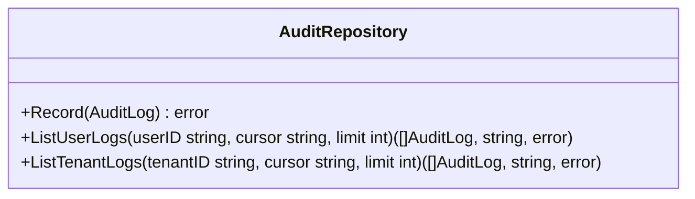

# Repository Definitions

Repositories are the only layer that touches the database.
They accept and return domain structs defined in structs.md.
No business logic lives here — only data access.

---

## 1. Tenant Repository

Manages tenant-scoped resources: tenants, roles, role permissions, and invitations.

---

## 2. User Repository

Manages identity-owned data: users, devices, MFA methods, password resets.

---

## 3. Auth Repository

Handles authentication lifecycle: refresh tokens and sessions.

---

## 4. Audit Repository

Stores and queries audit event logs.

