# Domain Services

Services contain all business logic. They are transport-agnostic — no HTTP or gRPC concepts here.
Services call repositories and emit audit logs. All mutating operations must record an audit log.
Personal tenant rules are enforced at this layer, not the repository layer.

---

## Rules

- Personal tenant users (`tenant.type == 2`) cannot be invited, assigned roles, or listed alongside org users
- Personal tenant data is always scoped by `user_id`, never by `tenant_id`
- Org tenant users are resolved by email domain match against `tenants.domain`
- Public email domains (gmail.com, yahoo.com, hotmail.com, outlook.com, etc.) are blocked for org registration
- The first user to register under an org tenant is automatically assigned the owner role
- Access tokens are short-lived JWTs; refresh tokens are long-lived and stored hashed
- All password comparison must use constant-time comparison to prevent timing attacks
- MFA challenge state is short-lived and must not be stored in the DB — use a signed temporary token

---

## 1. Auth Service

Handles login, logout, token lifecycle, and MFA verification.

### Methods

```
Login(tenantID, email, password string) (LoginResult, error)
VerifyMFA(tempToken, code string) (LoginResult, error)
Logout(sessionID string) error
LogoutAll(userID string) error
RefreshToken(refreshTokenRaw string) (TokenPair, error)
```

### LoginResult
```
type LoginResult struct {
    MFARequired bool
    TempToken   string    // populated only if MFARequired == true
    AccessToken  string   // populated only if MFARequired == false
    RefreshToken string   // populated only if MFARequired == false
    SessionID    string   // populated only if MFARequired == false
}
```

### TokenPair
```
type TokenPair struct {
    AccessToken  string
    RefreshToken string
}
```

### Claims
```
type Claims struct {
    UserID     string
    TenantID   string
    TenantType int16
    RoleID     *int64
    Email      string
}
```

---

### Login

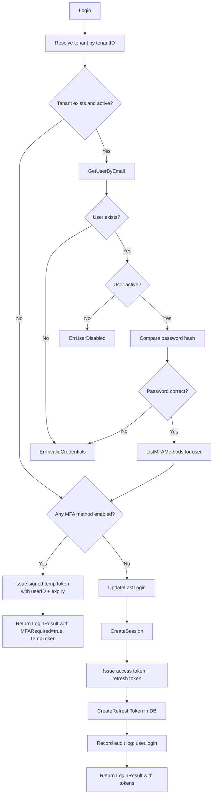

**Error cases**

| Error | Condition |
|---|---|
| ErrTenantNotFound | tenant does not exist |
| ErrTenantSuspended | tenant status is suspended or deleted |
| ErrInvalidCredentials | user not found or password wrong — same error to prevent enumeration |
| ErrUserDisabled | user status is disabled or pending |

---

### VerifyMFA

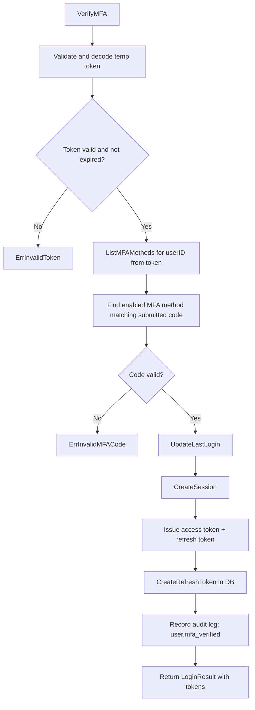

**Error cases**

| Error | Condition |
|---|---|
| ErrInvalidToken | temp token missing, malformed, or expired |
| ErrInvalidMFACode | code does not match any enabled MFA method |

---

### Logout

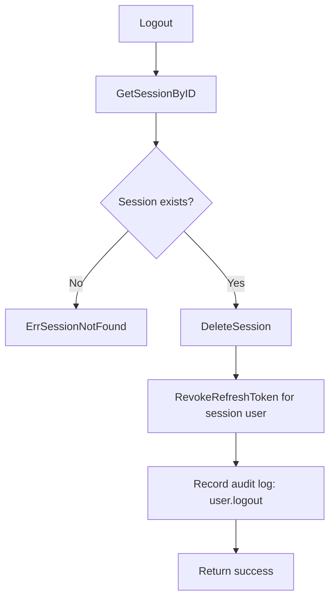

**Error cases**

| Error | Condition |
|---|---|
| ErrSessionNotFound | session does not exist or already deleted |

---

### LogoutAll

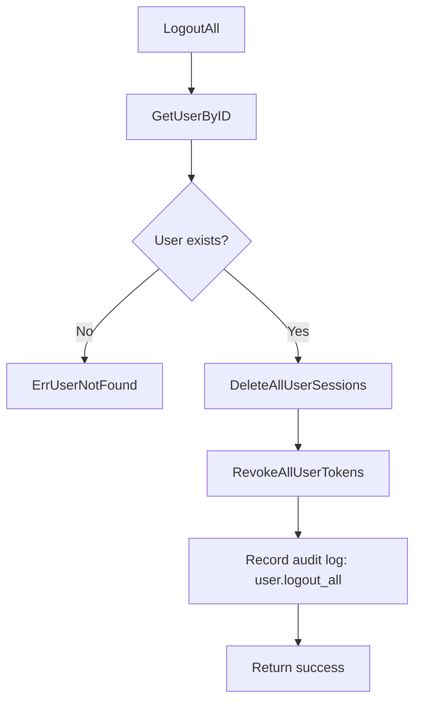

---

### RefreshToken

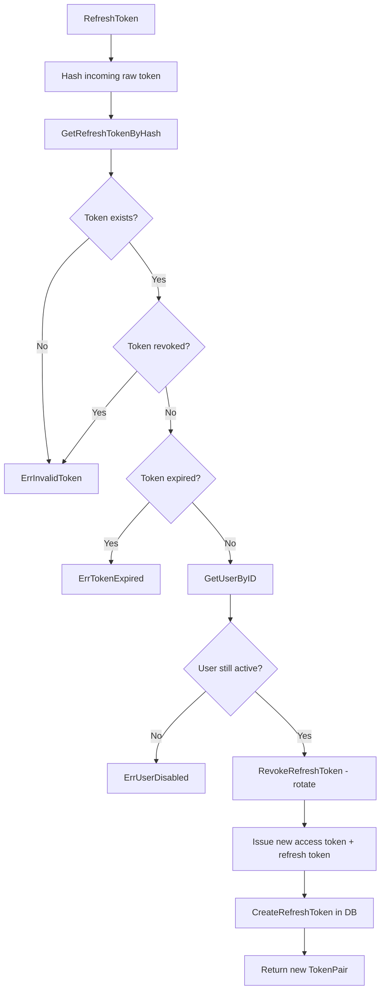

**Error cases**

| Error | Condition |
|---|---|
| ErrInvalidToken | token not found or revoked |
| ErrTokenExpired | token past expires_at |
| ErrUserDisabled | user no longer active |

---

## 2. Token Service

Handles JWT token generation, validation, and cryptographic operations.

### Methods

```
GenerateTokenPair(userID, tenantID string, roleID *int64) (TokenPair, error)
GenerateTempToken(userID string) (string, error)
ValidateTempToken(tempToken string) (string, error) // returns userID
GenerateResetToken() string
GenerateInvitationToken() string
ValidateAccessToken(token string) (Claims, error)
```

### ValidateAccessToken

Validates a JWT access token and returns its claims. No DB call unless token revocation list is implemented.

**Error cases**

| Error | Condition |
|---|---|
| ErrInvalidToken | token malformed or signature invalid |
| ErrTokenExpired | token past expiry |

---

## 3. Registration Service

Handles self-registration and invitation-based signup.

### Methods

```
RegisterIndividual(email, password, fullName string) (User, error)
RegisterOrgUser(email, password, fullName string) (User, error)
RegisterWithInvitation(invitationToken, password, fullName string) (User, error)
```

---

### RegisterIndividual

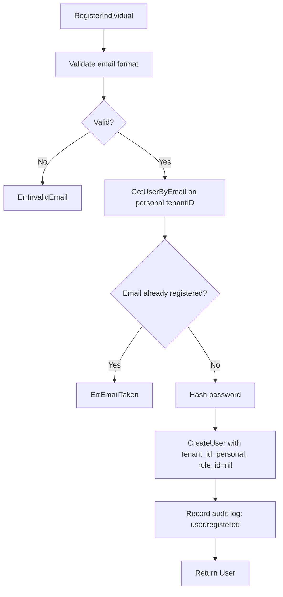

**Error cases**

| Error | Condition |
|---|---|
| ErrInvalidEmail | email format invalid |
| ErrEmailTaken | email already registered under personal tenant |

---

### RegisterOrgUser

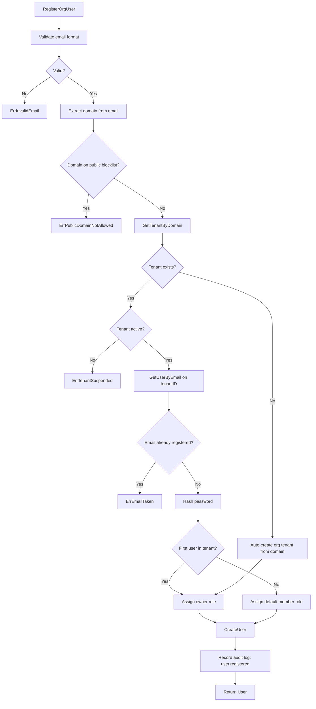

**Error cases**

| Error | Condition |
|---|---|
| ErrInvalidEmail | email format invalid |
| ErrPublicDomainNotAllowed | domain is on public provider blocklist |
| ErrTenantSuspended | tenant exists but is suspended or deleted |
| ErrEmailTaken | email already registered under this tenant |

---

### RegisterWithInvitation

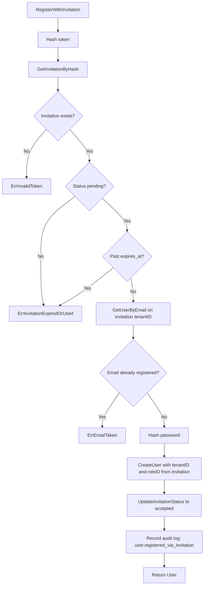

**Error cases**

| Error | Condition |
|---|---|
| ErrInvalidToken | invitation token not found |
| ErrInvitationExpiredOrUsed | invitation status is not pending or past expires_at |
| ErrEmailTaken | email already registered under this tenant |

---

## 3. Password Service

Handles password reset and change.

### Methods

```
RequestPasswordReset(tenantID, email string) error
ResetPassword(token, newPassword string) error
ChangePassword(userID, currentPassword, newPassword string) error
```

---

### RequestPasswordReset

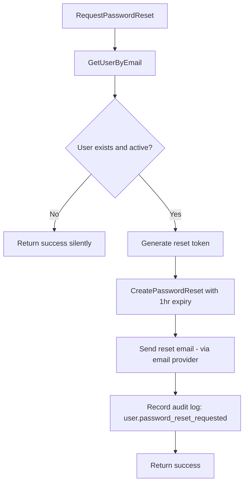

> Always returns success even if email not found — prevents user enumeration.

---

### ResetPassword

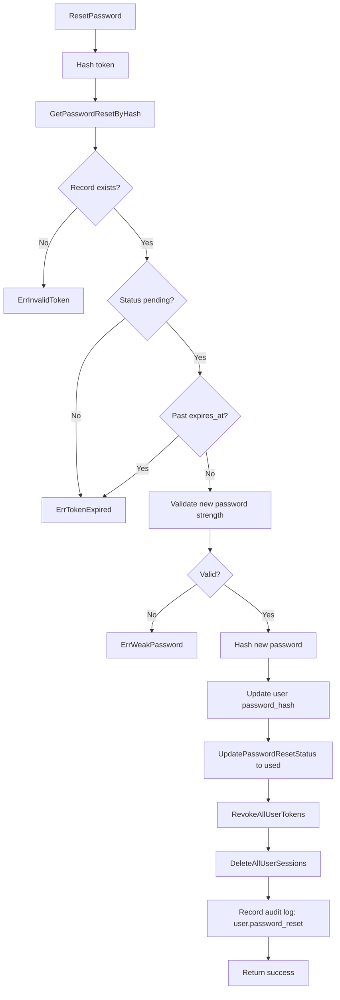

**Error cases**

| Error | Condition |
|---|---|
| ErrInvalidToken | token not found |
| ErrTokenExpired | status not pending or past expires_at |
| ErrWeakPassword | password fails strength rules |

---

### ChangePassword

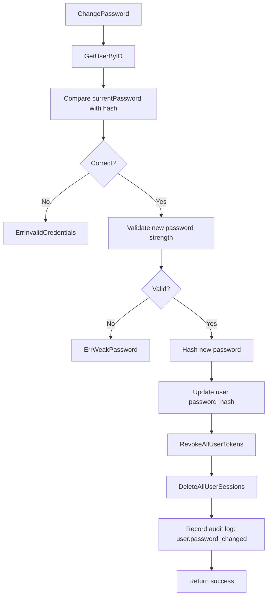

---

## 4. MFA Service

Handles MFA enrollment and management.

### Methods

```
EnrollTOTP(userID string) (TOTPEnrollment, error)
ActivateTOTP(userID, mfaID, code string) error
EnrollSMS(userID, phoneNumber string) error
ActivateSMS(userID, mfaID, code string) error
DisableMFAMethod(userID, mfaID string) error
ListMFAMethods(userID string) ([]UserMFAMethod, error)
```

### TOTPEnrollment
```
type TOTPEnrollment struct {
    MFAID     string
    Secret    string
    QRCodeURL string
}
```

---

### EnrollTOTP

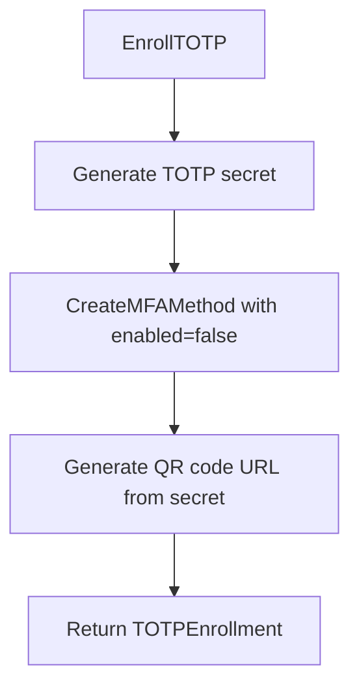

> Method is created with `enabled=false` until user verifies with ActivateTOTP.

---

### ActivateTOTP

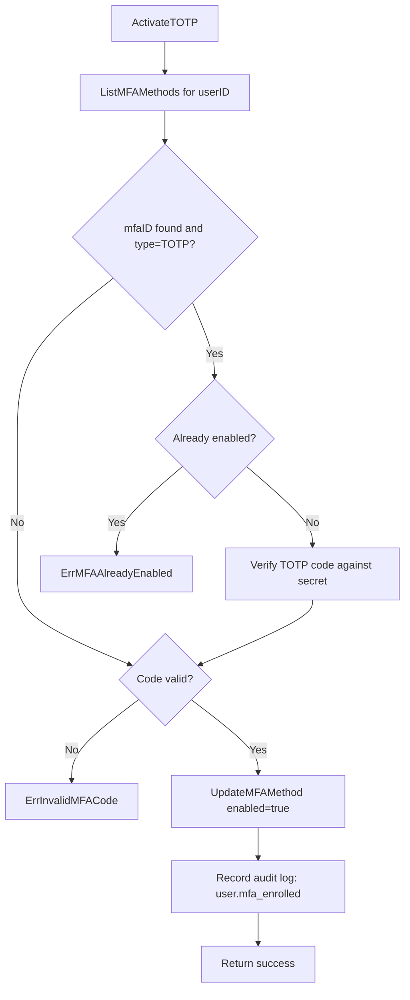

---

### DisableMFAMethod

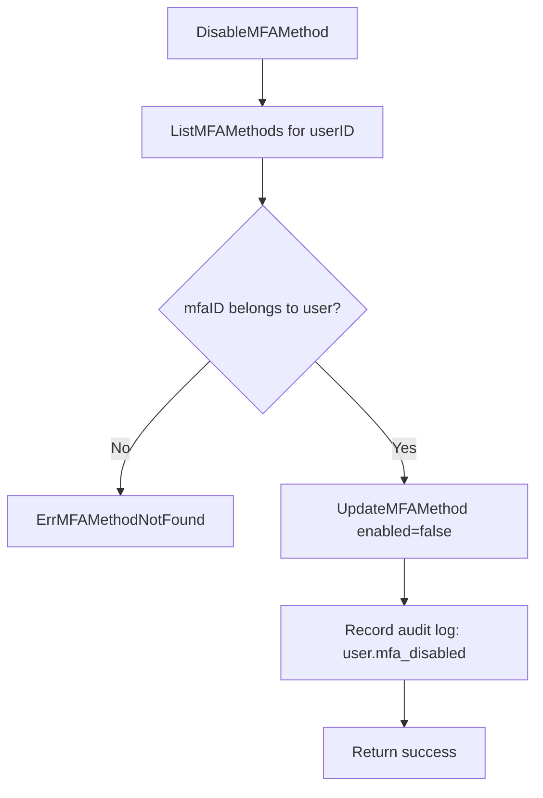

---

## 5. User Service

Handles profile and user management within a tenant.

### Methods

```
GetProfile(userID string) (User, error)
UpdateProfile(userID, fullName string) error
ListUsers(tenantID string, limit, offset int) ([]User, error)
GetUser(userID string) (User, error)
UpdateUserStatus(actorID, targetUserID string, status int16) error
AssignRole(actorID, targetUserID string, roleID int64) error
```

> ListUsers must never be called with the personal tenantID — enforce at service layer.

---

### UpdateUserStatus

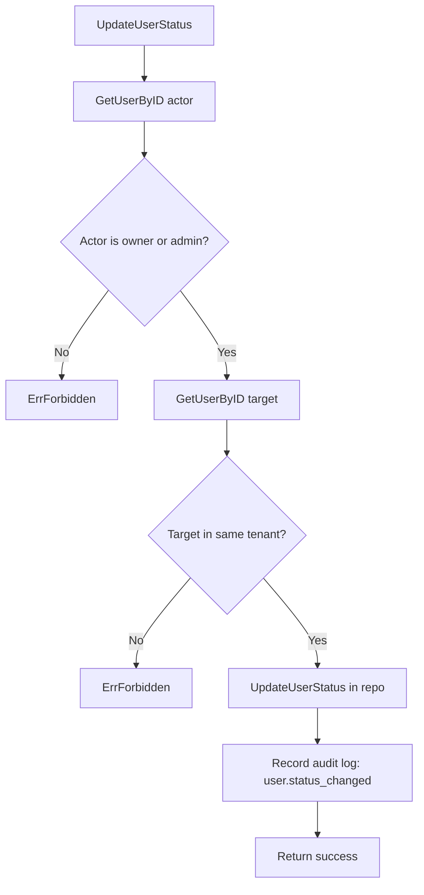

---

### AssignRole

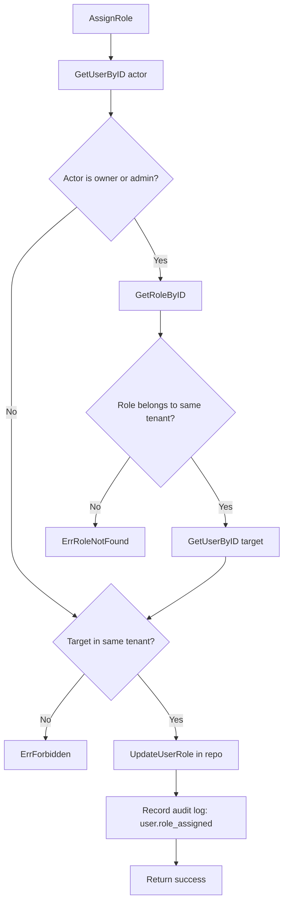

---

## 6. Invitation Service

Handles sending, listing, and revoking invitations. Org tenants only.

### Methods

```
SendInvitation(actorID, tenantID, email string, roleID int64) error
ListInvitations(tenantID string, limit, offset int) ([]Invitation, error)
RevokeInvitation(actorID, invitationID string) error
ResendInvitation(actorID, invitationID string) error
```

---

### SendInvitation

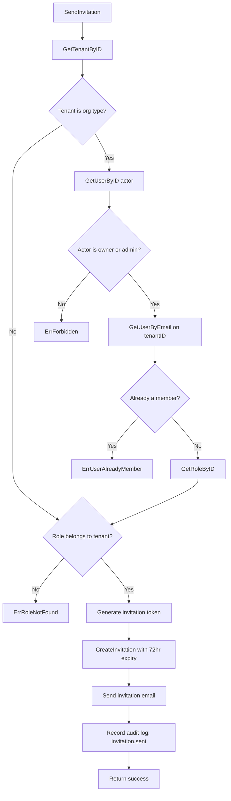

---

### RevokeInvitation

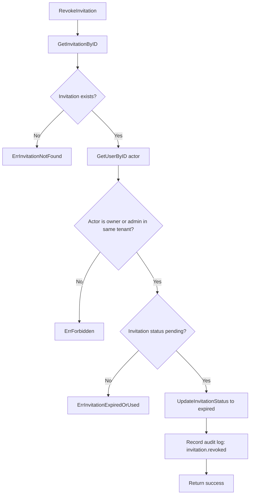

---

## 7. Role Service

Handles role and permission management. Org tenants only.

### Methods

```
CreateRole(actorID, tenantID, name string) (Role, error)
DeleteRole(actorID string, roleID int64) error
ListRoles(tenantID string, limit, offset int) ([]Role, error)
GetRolePermissions(roleID int64) ([]RolePermission, error)
SetRolePermissions(actorID string, roleID int64, keys []string) error
```

---

### CreateRole

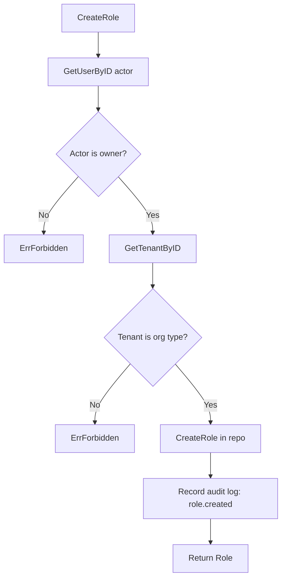

---

### DeleteRole

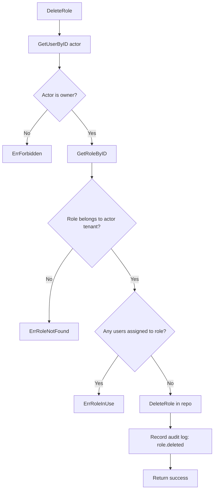

---

## 8. Session & Device Service

### Methods

```
ListSessions(userID string, limit, offset int) ([]Session, error)
RevokeSession(actorID, sessionID string) error
ListDevices(userID string, limit, offset int) ([]Device, error)
RemoveDevice(actorID, deviceID string) error
```

---

### RevokeSession

```mermaid
flowchart TD
    A[RevokeSession] --> B[GetSessionByID]
    B --> B1{Session exists?}
    B1 -- No --> E1[ErrSessionNotFound]
    B1 -- Yes --> C{Session belongs to actorID?}
    C -- No --> E2[ErrForbidden]
    C -- Yes --> D[DeleteSession]
    D --> E[Record audit log: session.revoked]
    E --> F[Return success]
```

---

### RemoveDevice

```mermaid
flowchart TD
    A[RemoveDevice] --> B[GetDeviceByID]
    B --> B1{Device exists?}
    B1 -- No --> E1[ErrDeviceNotFound]
    B1 -- Yes --> C{Device belongs to actorID?}
    C -- No --> E2[ErrForbidden]
    C -- Yes --> D[DeleteDevice]
    D --> E[Record audit log: device.removed]
    E --> F[Return success]
```

---

## 9. Tenant Service

### Methods

```
CreateTenant(name, domain string) (Tenant, error)
GetTenant(tenantID string) (Tenant, error)
UpdateTenantStatus(actorID, tenantID string, status int16) error
```

> CreateTenant is a superadmin or system-level operation, not user-facing.

---

## 10. Audit Service

### Methods

```
ListUserLogs(actorID, userID, cursor string, limit int) ([]AuditLog, string, error)
ListTenantLogs(actorID, tenantID, cursor string, limit int) ([]AuditLog, string, error)
```

Both methods verify the actor has permission to view the requested logs before calling the repository.

---

## Error Catalog

| Error | Description |
|---|---|
| ErrInvalidCredentials | wrong email or password |
| ErrUserNotFound | user does not exist |
| ErrUserDisabled | user is disabled or pending |
| ErrUserAlreadyMember | user already belongs to tenant |
| ErrEmailTaken | email already registered in this tenant |
| ErrInvalidEmail | email format invalid |
| ErrPublicDomainNotAllowed | email domain is a public provider |
| ErrWeakPassword | password fails strength requirements |
| ErrTenantNotFound | tenant does not exist |
| ErrTenantSuspended | tenant is suspended or deleted |
| ErrInvalidToken | token missing, malformed, revoked, or not found |
| ErrTokenExpired | token past expiry |
| ErrSessionNotFound | session does not exist |
| ErrDeviceNotFound | device does not exist |
| ErrRoleNotFound | role does not exist or belongs to different tenant |
| ErrRoleInUse | role has users assigned, cannot delete |
| ErrMFAMethodNotFound | MFA method not found for user |
| ErrMFAAlreadyEnabled | MFA method already active |
| ErrInvalidMFACode | submitted MFA code is incorrect |
| ErrInvitationNotFound | invitation does not exist |
| ErrInvitationExpiredOrUsed | invitation is not in pending status |
| ErrForbidden | actor lacks permission for this operation |